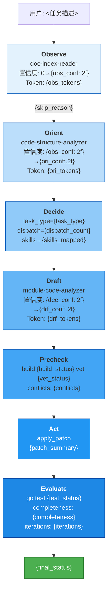

# 日志分析规范

Evaluate 阶段结束时，基于结构化日志自动生成分析摘要。

---

## 输出格式

```json
{
  "index": {
    "log_analysis": {
      "workflow_quality": {"score": "optimal|normal|degraded", "notes": ["..."]},
      "info_gain": {"index_delta": 0.0, "structure_delta": 0.0, "assessment": "..."},
      "token_efficiency": {"draft_tokens_total": 0, "assessment": "..."},
      "risk_signals": ["..."],
      "recommendations": ["..."]
    }
  }
}
```

---

## 维度 1：工作流质量

| 信号 | 来源日志 | optimal | normal | degraded |
|------|---------|:-------:|:------:|:--------:|
| 迭代次数 | `Evaluate iterations=N` | 1 | 2 | >=3 |
| 是否回退过 | `iteration=N from=Evaluate to=...` | 无 | 1 次 | >=2 次 |
| 阶段完整性 | 阶段转换序列 | 7 阶段全 | 跳过 Orient | 跳过多个 |
| 补丁失败 | `phase=Act status=failed` | 0 | 0 | >=1 |

**判定规则：**

- iterations == 1, 无回退, 无补丁失败 -> **optimal** — "一次通过，无回退，工作流效率满分"
- iterations <= 2, 回退 <= 1, 无补丁失败 -> **normal**
- 其他 -> **degraded**

特殊：task_type == "review" 且无补丁 -> "审查任务，无代码变更，属正常路径"

---

## 维度 2：信息增益

从 confidence_before / confidence_after 日志计算：

- index_delta = Observe.after - Observe.before
- structure_delta = Orient.after - Orient.before

### index_delta 解读

| 值 | 含义 |
|:--:|------|
| >= 0.7 | 索引文件质量极高 |
| 0.4-0.7 | 基本结构具备，有未知项 |
| < 0.4 | 索引不足，建议补充文档 |

### structure_delta 解读

| 值 | 含义 |
|:--:|------|
| >= 0.3 | 代码结构工具贡献显著 |
| 0.1-0.3 | 有用但非关键 |
| < 0.1 | 边际增益低，可考虑跳过 Orient |

### assessment 自动生成

- structure_delta < 0.1 且 task_type == "bugfix" 且 dispatch_count == 1
  -> "代码结构工具增益低，建议为此类任务设 Orient 跳过阈值"
- index_delta < 0.4
  -> "索引文件覆盖不足，建议补充相关文档"
- 否则 -> "信息增益符合预期"

---

## 维度 3：Token 效率

draft_tokens_total = sum(所有 module-code-analyzer 的 tokens_estimated)

| 值 | 评估 |
|:--:|------|
| < 1000 | 高效 |
| 1000-3000 | 正常 |
| > 3000 | 偏高，考虑缩小 scope |

---

## 维度 4：风险信号

| 风险 | 匹配规则 | 级别 |
|------|---------|:--:|
| 补丁失败 | phase=Act status=failed | 高 |
| 构建失败 | phase=Precheck build=fail | 高 |
| 测试回归 | phase=Evaluate tests=N/M 且 N<M | 中 |
| 迭代耗尽 | iteration=3 to=done | 中 |
| 置信度下降 | delta < -0.1 | 中 |
| 代码结构工具超时 | error=structure_timeout | 低 |

### recommendations 自动生成

| 触发 | 建议 |
|------|------|
| build=fail | 检查补丁语法；Draft 阶段增加预检 |
| tests=N/M (N<M) | 回归测试失败，检查失败用例 |
| iterations=3 | 人工介入，任务未完成 |
| confidence drop | 补充该阶段上下文策略 |
| structure_timeout | 检查 代码结构工具服务状态 |

---

## 与 Evaluate 阶段集成

Evaluate 输出中 log_analysis 为 index 必填字段。

提前终止时生成不完整分析：

```
[go-workflow] analysis=partial  terminated_at=Act  cause=patch_conflict
```

此时 log_analysis.workflow_quality.score = "degraded"。

---

## 可视化输出

Evaluate 阶段结束时输出可视化图表。输出级别由 `output_detail` 配置项控制：

| 级别 | 输出内容 | 适用场景 |
|:---:|------|------|
| **minimal** | `log_analysis` JSON + 日志文件路径 | 日常开发、单文件修复、简单 bugfix |
| **standard** (默认) | minimal + Mermaid 流程图 + 关键指标仪表盘 | 常规 feature、多文件修改 |
| **full** | standard + 全部 6 种图表 | 跨模块重构、多迭代任务、代码审查 |

**自动升级规则：** 以下情况即使配置为 `minimal` 也自动升级到 `standard`：
- 迭代次数 >= 2
- 跨模块变更（dispatch_count >= 2）
- task_type 为 `refactor` 或 `review`

以下 6 种图表仅在 `output_detail: full` 时全部输出。图表基于结构化日志自动生成，不允许手工美化数据。

---

### 图表 1：Mermaid 阶段流程图

展示完整的 OODA-E 阶段转换、SubAgent 调度、关键数据点。



**变量替换规则：**
- `skip_reason`: 若跳过 Orient → `"confidence>=0.8，跳过"`；否则 → `"代码结构工具定向分析"`
- `final_status`: 若 completeness=done → `"✅ 完成"`；否则 → `"⚠️ 部分完成"`
- `{obs_conf}` 等：从日志中提取对应阶段的 confidence 值
- `build_status`/`vet_status`: `pass` → `✅`，`fail` → `❌`

---

### 图表 2：置信度爬升曲线

ASCII 字符画，7 个数据点标注。

```
  1.00 ┤                                         ●
       │                                      Draft (0.95)
  0.90 ┤                         ●
       │                    Orient (0.92)
  0.80 ┤               ●
       │          Observe (0.80)
  0.70 ┤
       │
  0.00 ┼────────┬────────┬────────┬────────┬────────┬────────
        Observe  Orient   Decide   Draft  Precheck  Act/Eval
        +0.80    +0.12      —     +0.03      —         —
```

**生成规则：**
- Y 轴：0.00 到 1.00，间隔 0.10
- ● 位置：`int(confidence × 40)` 列偏移
- 底部标注：阶段名 + delta 值
- 若某阶段无子阶段置信度变化，使用前序阶段值

---

### 图表 3：Token 流向图

```text
  数据源              过滤层              主Agent上下文

 INDEX.md ──────► doc-index-reader ──────► 模块认知模型
 (21KB)          (读 chunks, 不读全文)      "7领域 DDF架构"
                        │
                   [400t]

 structure.json ───► code-structure-analyzer ─────► 依赖图+调用链
 (2401行)         (4次 MCP 查询)            "单文件 无跨域依赖"
                        │
                   [180t]

 http_handler.go ─► module-code-analyzer ──► 精确补丁
 (178行)           (仅读14行 PreClose段)      "+6 -1 行"
                        │
                   [300t]

 ────────────────────────────────────────────
 主 Agent 上下文总计: ~980t (全部结构化数据, 0行源码)
 如果无 MCP 模式:    ~7000t (含 375+ 行源码)
 节省:               6020t (86%)
```

**生成规则：**
- 每个数据源一行：原始大小 → Agent 名 → 消费量 → 最终形式
- Token 数从日志 `tokens_estimated` 和 `chunks_passed` 字段提取
- MCP vs 无 MCP 对比：无 MCP 模式估算 = Σ(相关源码文件行数 × 8)
- 节省百分比 = (无MCP - MCP) / 无MCP × 100

---

### 图表 4：SubAgent 交互时序

```text
 主 Agent
   │
   │── spawn ──► doc-index-reader
   │               │ 读 INDEX.md, README.md, AGENTS.md
   │◄── return ───┘ 返回: modules, confidence=0.80
   │
   │── spawn ──► code-structure-analyzer
   │               │ 4次代码结构工具 MCP 查询
   │◄── return ───┘ 返回: impact_scope, confidence=0.92
   │
   │ Decide: task_type=bugfix, dispatch=1, skills→go-coding
   │
   │── spawn ──► module-code-analyzer
   │               │ scope: http_handler.go:135-143
   │               │ skills: [go-coding]
   │               │ 读取14行源码, 生成补丁
   │◄── return ───┘ 返回: patch +6/-1, confidence=0.95
   │
   │ Precheck: go build ✓  go vet ✓  conflicts=0
   │ Act: apply_patch → applied
   │ Evaluate: go test ✓  completeness=done  iterations=1
   │
   ▼
 完成
```

---

### 图表 5：关键指标仪表盘

```text
┌────────────────────────────┬─────────────────────────────────────┐
│ 🟢 工作流质量              │ {quality_score} ({quality_notes})    │
│ 🟢 阶段完整性              │ {completed_phases}/7                 │
│ 🟢 迭代次数                │ {iterations} ({rollback_detail})     │
│ 🟢 构建                    │ {build_status}                       │
│ 🟢 静态检查                │ {vet_status}                         │
│ 🟢 测试                    │ {test_summary}                       │
├────────────────────────────┼─────────────────────────────────────┤
│ 📊 信息增益                │                                     │
│   index_delta              │ {index_delta_bar}                    │
│   structure_delta            │ {structure_delta_bar}                  │
├────────────────────────────┼─────────────────────────────────────┤
│ 💰 Token 效率              │                                     │
│   总消耗                   │ {total_tokens}t                      │
│   主Agent 源码暴露         │ 0 行                                │
│   实际源码读取             │ {lines_read} / {lines_total} 行      │
│   对比无 MCP               │ -{saved_tokens}t (节省 {saved_pct}%) │
├────────────────────────────┼─────────────────────────────────────┤
│ 🔧 变更                    │                                     │
│   文件                     │ {changed_files}                     │
│   改动                     │ {diff_summary}                       │
│   类型                     │ {change_type}                        │
│   行为变更                 │ {behavior_change}                    │
└────────────────────────────┴─────────────────────────────────────┘
```

**变量替换规则：**
- `quality_score`: `optimal` → `🟢 optimal`，`normal` → `🟡 normal`，`degraded` → `🔴 degraded`
- `index_delta_bar`: `"+" + str(delta) + " " + "█" * int(delta * 20)`
- `lines_read`: 从日志 `scope` 和 `chunks_passed` 推算
- `saved_pct`: `round((7000 - total_tokens) / 7000 * 100)`

---

### 图表 6：MCP vs 无 MCP 对比表

```
┌────────────────┬──────────┬──────────┬──────────┐
│ 指标           │ MCP 模式 │ 无 MCP   │ 节省     │
├────────────────┼──────────┼──────────┼──────────┤
│ Token 总消耗   │ {mcp_tokens:>5}   │ {noless_tokens:>5}   │ {saved_tokens:>5} ({saved_pct}%) │
│ 主Agent源码    │   0 行   │ {noless_lines}+ │ 100%     │
│ 阶段完整性     │   7/7    │   2-3    │ +4 阶段  │
│ 可审计日志     │   {log_count} 条  │    0     │ ∞        │
│ 可复现性       │    高    │    中    │ —        │
│ 上下文结构     │  JSON    │  源码    │ —        │
└────────────────┴──────────┴──────────┴──────────┘
```

---

### 输出顺序

每次 Evaluate 阶段输出按以下顺序：

1. **log_analysis JSON** (机器可读)
2. **Mermaid 流程图** (整体概览)
3. **置信度爬升曲线** (信息增益)
4. **Token 流向图** (效率分析)
5. **SubAgent 交互时序** (协作模式)
6. **关键指标仪表盘** (摘要)
7. **MCP vs 无 MCP 对比** (ROI)

## 阈值速查

| 参数 | 阈值 | 含义 |
|------|:----:|------|
| index_delta < 0.4 | 告警 | 索引不足 |
| structure_delta < 0.1 | 提示 | 可跳过 Orient |
| draft_tokens_total > 3000 | 告警 | 上下文过多 |
| iterations >= 3 | 告警 | 未收敛 |
| confidence drop > 0.1 | 告警 | 意外信息 |