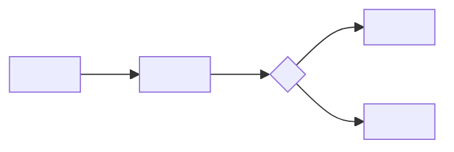

# Create SOP

Turn a process narrative into a **runbook DAG**: a person with the stated role can perform the work reliably, recognize each decision gate, handle known exceptions, and leave the evidence the next person needs. The **SOP** is the canonical artifact; the input narrative is source material, not the output structure.

## Conceptual Space

```yaml
conceptual_space:
  target_region: "User-supplied business, operational, support, compliance, or technical processes that need a repeatable, human-executable SOP DAG."
  deviation_region:
    - "Route product requirements, implementation plans, or architecture decisions to their planning or domain-design workflow."
    - "Route an unknown or contested process to discovery, research, or a decision-making workflow before claiming it is an SOP."
    - "Route executable automation, scripts, and code changes to the applicable implementation workflow after the SOP defines the operating contract."
    - "Keep policy, legal, security, and safety requirements as supplied or explicitly sourced; do not invent authority."
  priority_dimensions:
    - "Faithful operational intent over fluent paraphrase."
    - "Observable triggers, roles, node outcomes, blocking edges, gates, evidence, and exits over generic advice."
    - "True prerequisites and safe parallelism over a visually linear but false sequence."
    - "Safe escalation and explicit uncertainty over invented detail."
    - "One canonical SOP and linked supporting material over duplicate instructions."
  entry_conditions:
    - "The user provides a process, however informal, and wants it made repeatable or documented as an SOP."
    - "The intended users, output location, and level of formality are known or can be safely defaulted."
  exit_conditions:
    - "Every material input activity is represented by one DAG node, deliberately omitted as out of scope, or recorded as an open item."
    - "Every node has a named outcome, accountable role, evidence where needed, and only its genuine blocking edges."
    - "The DAG is acyclic; every applicable node is reachable from a start node and leads to a completion or escalation terminal."
    - "The SOP contains a runnable happy path, decision gates, exception or escalation handling, evidence, and a completion condition."
    - "A dry run can follow the graph frontier without relying on unstated process knowledge."
  pre_output_check:
    - "Identify the canonical SOP, its intended operator, trigger, completion evidence, and current frontier."
    - "Check every edge as a real prerequisite and every conditional branch as mutually clear."
    - "Separate source-backed facts, safe defaults, and unresolved questions."
    - "Report the SOP location or inline artifact, plus material assumptions and open items."
  sedimentation:
    - "Leave only the requested SOP and essential supporting artifacts."
    - "Do not leave scratch extraction notes, duplicate procedures, or speculative policy behind."
```

## The runbook DAG

Normalize every process into a directed acyclic graph (DAG). A node is an operational slice that delivers one observable result; an edge `A → B` means **B is blocked by A**. The graph may expose independent work in parallel, but never puts an operator on a node before its blockers and branch conditions are satisfied.

```text
Trigger → Prepare ──┬→ Verify ──┐
                    └→ Approve ─┼→ Complete
Decision ──yes→ Execute ────────┘
         └─no → Escalate
```

- **Start node** identifies the trigger and the run's initial inputs.
- **Action node** has an accountable role and produces an observable result or handoff.
- **Decision node** names a condition, decision owner, and explicit outgoing branches.
- **Terminal node** proves successful completion or a bounded escalation outcome.
- **Blocking edge** represents a prerequisite, not a useful reference, a preference, or merely the order in which the source narrative mentioned work.
- **Frontier** is the set of applicable, unblocked nodes. It is the work an operator may take now.

Make each node a **vertical operational slice**: it contains the action, relevant decision, evidence, and handoff needed to produce its outcome. Split a node only when ownership, a prerequisite, a branch, or independently verifiable completion changes. A graph node is a named procedure, not a bare command or a generic phase heading.

The graph is an **index**, not a second procedure. It holds node names, blockers, activation conditions, and outcomes; each node's detailed instructions live exactly once in its own section.

## Operational fog

The source process can contain **operational fog**: details the user has not supplied but an operator needs in order to act safely. Keep that fog visible rather than filling it with plausible prose.

- Put a fact in the SOP when the source states it or an authoritative source verifies it.
- Use `[confirm: …]` when a missing value changes a step, gate, owner, safety condition, or completion evidence.
- Put a genuinely non-applicable activity in the scope boundary; do not disguise it as a missing detail.
- Keep each unresolved detail in **Open items** once, with its owner and operational impact. It graduates into the relevant SOP step only when resolved.

## Workflow

| Step | Action | Completion criterion |
|---|---|---|
| **Frame** | State the SOP's purpose, intended operator, trigger, scope, and destination. Choose a documentation location and title when the user has asked for a durable artifact. | A reader can tell when to use this runbook and when not to. |
| **Extract** | Parse the supplied process into facts: roles, systems, inputs, actions, decisions, handoffs, records, timing, risks, and outcomes. Preserve the user's domain terms. | Every material statement in the input is classified as an SOP element, an out-of-scope item, or an unresolved question. |
| **Cut nodes** | Group the process into vertical operational slices with named, independently verifiable outcomes. Keep actions that share an owner and cannot safely or meaningfully be separated in one node. | Every in-scope activity belongs to one node, and every node has a named outcome. |
| **Wire the DAG** | Create nodes first, then add `A → B` blocking edges in a second pass. Add an edge only when B cannot start until A's result exists; record gate outcomes as activation conditions. | The graph has no cycle, no duplicate node detail, and a correctly identified start set, terminal set, and initial frontier. |
| **Close gaps** | Resolve only the gaps that would make an operator unable to start, take a frontier node, choose a branch, safely continue, or know they are done. Ask concise, grouped questions when the answer requires the user's authority; otherwise label a safe operational default as an assumption. | No silent gap controls execution, safety, ownership, a blocking edge, or completion. |
| **Compose** | Write the graph and node procedures using the template below. Put detailed instruction, evidence, and exception handling in the owning node. | The happy path, each known branch, exception path, handoff, and evidence requirement is represented once. |
| **Dry run** | Walk one normal path and one plausible exception by repeatedly selecting an applicable node from the frontier. Check that each chosen node is unblocked and each terminal has the required record. | Both simulations reach a terminal without unstated knowledge; gaps are fixed or appear in Open items. |
| **Hand off** | Deliver or save the canonical SOP. State material assumptions, open items, and any required owner review. | The user receives a runnable DAG SOP and can distinguish settled procedure from items awaiting authority. |

## SOP template

Use this structure unless the user's existing documentation standard requires another. Omit an empty optional section; never omit the DAG, node procedures, or completion criteria.

````markdown
# <SOP title>

## Purpose

<The outcome this SOP reliably produces.>

## Scope

- Use when: <trigger and applicability>
- Do not use when: <boundary>
- Owner: <role accountable for the procedure>

## Roles and access

| Role | Responsibility | Required access or inputs |
|---|---|---|
| <role> | <responsibility> | <access/input> |

## Preconditions

- <check that must be true before starting>

## Run graph



| Node | What it delivers | Blocked by | Activation condition | Owner |
|---|---|---|---|---|
| <N01 — node name> | <observable outcome> | None — start node | <trigger> | <role> |
| <N02 — node name> | <observable outcome> | <node name> | <always / gate outcome> | <role> |

The initial frontier is: <all applicable start nodes by name>.

## Nodes

### <N01 — node name>

**What it delivers:** <observable outcome>.

**Blocked by:** <node names, or `None — start node`>.

**Activation condition:** <trigger, `always`, or named decision outcome>.

**Procedure:**

1. <imperative instruction>.

**Owner:** <role>.

**Evidence/output:** <record, identifier, or handoff>.

**Decision, if applicable:**

- If <condition>: enable <named node>.
- Otherwise: enable <named node>.

## Exception and escalation terminals

| Terminal node | Activation condition | Escalate to | Record |
|---|---|---|---|
| <N05 — terminal name> | <failed condition or exception> | <role/channel> | <evidence> |

Detailed exception action belongs in the terminal node, not in this index.

## Completion and records

- Complete when: <observable finished state>.
- Notify/handoff to: <role or destination>.
- Retain: <records, location, and retention rule if supplied>.

## Open items

- <Only unresolved, authority-dependent detail; include its owner and impact.>
````

## Output rules

- Use the user's domain language consistently; define an unfamiliar term at its first operational use when it affects execution.
- Write concrete verbs, named systems, thresholds, and destinations when supplied. Mark unsupplied but necessary values as `[confirm: …]` rather than fabricating them.
- Link a source procedure, policy, form, or system of record instead of duplicating its changing contents. The SOP remains the single orchestration layer.
- Refer to nodes by their names in prose; IDs exist only to make the graph and node headings unambiguous.
- Give a node a numbered substep only when an operator must perform it independently; keep explanation in a note or referenced material.
- Keep blockers minimal and explicit. A node may run in parallel with another only when neither requires the other's output and their activation conditions are compatible.
- Verify the DAG before handoff: no cycles, no orphan nodes, no node blocked by itself, all branches lead to a terminal, and each material operation has one owning node.
- Keep authority boundaries explicit: the executor acts, the owner decides, and the escalation contact resolves exceptions.

## Output

Report the canonical SOP and its location. Include only material assumptions, `[confirm: …]` items, and requested review points; do not restate the whole source narrative outside the SOP.
