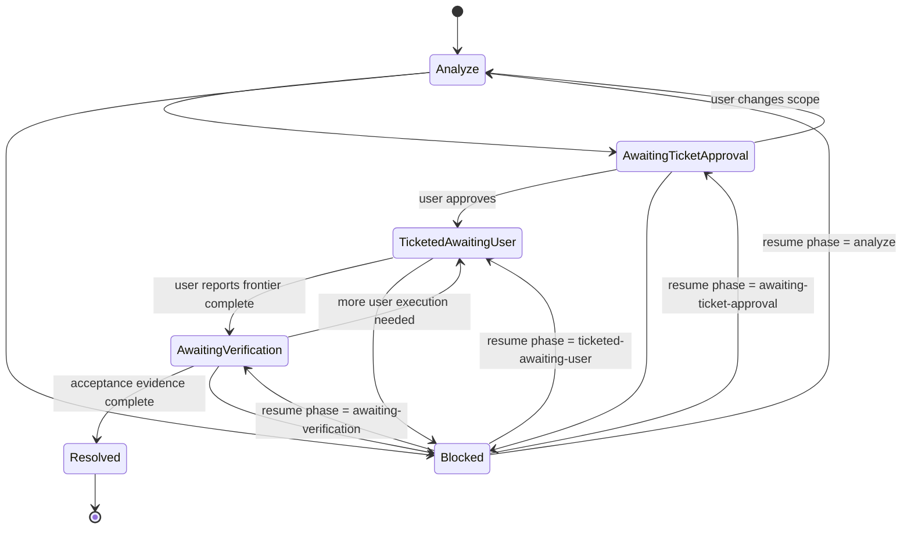

# Problem Ticket SOP

Run a problem through a **case file**: a small, durable state directory that records what is known, what the user must decide or execute, and the next permitted action. The case file prevents an agent from treating a problem report as authorization to change the product.

The agent analyzes and maintains the case file. The user executes tickets. The case file is the canonical handoff artifact.

## Conceptual Space

```yaml
conceptual_space:
  target_region: "A reported problem that must be understood, decomposed into user-executed tickets, and resumed safely across model handoffs."
  deviation_region:
    - "Route direct implementation, source edits, tests, deployments, commits, and pushes to the user or an explicitly authorized implementation workflow."
    - "Route a request for one self-contained answer or diagnosis without durable tickets to a lightweight analysis workflow."
    - "Route project-wide planning whose decisions are still in fog to a decision-mapping workflow before claiming the work is ready for tickets."
  priority_dimensions:
    - "Explicit user authority and phase gates over forward progress."
    - "A current, single-source case file over conversational memory."
    - "True ticket blocking edges and verifiable outcomes over a linear checklist."
    - "Narrow, user-executed tickets over agent-driven implementation."
  entry_conditions:
    - "The user supplies a problem report and wants a controlled treatment path, tickets, or durable handoff state."
    - "A repository root or an explicit directory is available for the case file, or the user accepts the local default."
  exit_conditions:
    - "The case file records the current phase, ticket frontier, next permitted action, owner, and unresolved blockers."
    - "Every published ticket has a named outcome, acceptance criteria, status, and only genuine blocking edges."
    - "The agent has not performed an execution action reserved for the user."
  pre_output_check:
    - "Load STATE.md before taking any action when a case file exists."
    - "Confirm the proposed action is allowed by the recorded phase and user authorization."
    - "Report the case-file path, phase, frontier, and exact next user action."
  sedimentation:
    - "Keep STATE.md and one ticket file per ticket current; append compact state-history entries instead of relying on chat history."
    - "Leave no source edits, implementation branches, generated artifacts, or duplicate ticket descriptions."
```

## The case file

Use a user-supplied directory when one exists. Otherwise create one local case file at:

```text
.scratch/<problem-slug>/
├── STATE.md
└── issues/
    ├── 01-<ticket-slug>.md
    └── 02-<ticket-slug>.md
```

`STATE.md` is an index, not a duplicate ticket store. It holds the phase, frontier, next action, ticket status summary, blockers, and handoff facts. Each ticket's full intent and acceptance criteria live only in its file.

## State machine



| Phase | Agent may do | Required user action before advancing |
|---|---|---|
| `analyze` | Inspect supplied evidence read-only; record facts, hypotheses, scope, and a draft ticket DAG. | Answer authority-dependent questions when needed. |
| `awaiting-ticket-approval` | Explain the proposed tickets and wait. | Explicitly approve, merge, split, or reject the ticket DAG. |
| `ticketed-awaiting-user` | Maintain statuses and explain the ready frontier. | Execute an unblocked ticket and report its outcome/evidence. |
| `awaiting-verification` | Review user-supplied evidence; perform only requested read-only checks. | Supply missing evidence or acknowledge the result. |
| `blocked` | Record the blocker, its owner, and the phase to resume. | Clear the blocker or change scope. |
| `resolved` | Read and summarize the closed case. | Reopen explicitly if new evidence changes the problem. |

Never cross an approval or execution gate from inference. Record the request that authorized a transition in the case-file history.

## Workflow

| Step | Action | Completion criterion |
|---|---|---|
| **Resume** | Locate and load `STATE.md`. If it does not exist, create the case file in the requested directory or the local default. | The current phase, prior decisions, active tickets, frontier, and next allowed action are known. |
| **Analyze** | Restate the problem, desired outcome, scope boundary, evidence, hypotheses, risks, and unknowns. Inspect repository or supplied artifacts only as needed to distinguish facts from hypotheses. | The case file contains an analysis sufficient to draft a narrow ticket DAG, or names the blocker that prevents one. |
| **Draft the ticket DAG** | Cut the work into vertical, user-executable tickets. Give each ticket a named outcome and acceptance criteria. Create ticket nodes first, then add only true blocking edges. | The DAG is acyclic; every ticket is reachable from the initial frontier and leads to a resolution or a bounded escalation. |
| **Gate** | Set phase to `awaiting-ticket-approval`; present titles, outcomes, blockers, and the frontier. | The case file names the exact approval or change request required from the user. |
| **Materialize** | After explicit user approval only, write one ticket file per approved node under `issues/`, ordered with blockers first. Set every ticket to `ready-for-user`, then set phase to `ticketed-awaiting-user`. | Ticket files and the STATE index agree on names, blockers, statuses, and frontier. |
| **Track user execution** | When the user reports work, update only the named ticket's status, evidence pointer, and the frontier. On a reported failure or missing prerequisite, set phase to `blocked` and preserve the current phase as `Resume phase`. | STATE.md records who reported what, the evidence location, each newly unblocked ticket, and the phase to restore after a blocker clears. |
| **Verify and close** | Move to `awaiting-verification` only after the user reports the applicable frontier complete. Review supplied evidence and requested read-only checks; resolve or return to `ticketed-awaiting-user`. | The case reaches `resolved` only when every applicable ticket has acceptance evidence, or it records a user-approved scope change. |
| **Hand off** | Update the compact history and report the case-file path, phase, frontier, blockers, and next user action. | A fresh model can continue from STATE.md without relying on earlier chat. |

## Ticket rules

- A ticket is a **vertical slice**: one narrow, complete, independently verifiable user outcome—not a vague layer task.
- An edge `A → B` means B cannot start until A's output exists. Do not use an edge for a preferred order, reference, or convenience.
- The **frontier** contains tickets whose blockers are `done` and whose activation conditions apply. Those tickets may be worked in parallel only when their outputs do not conflict.
- Record every activation condition in the ticket and the STATE index. Use `always` only when a ticket is applicable whenever its blockers are done.
- Keep implementation instructions in the ticket; keep the status index in STATE.md. Refer to tickets by name in prose, with IDs only for file identity.
- A scope change that invalidates a ticket marks it `superseded` with a reason; it does not silently rewrite history.

## STATE.md template

```markdown
# Case file: <problem title>

## Problem

<Observed problem, desired outcome, and source links.>

## Scope

- In scope: <boundary>
- Out of scope: <boundary>
- Case owner: <user role or named owner>

## Phase

- Current: `<analyze | awaiting-ticket-approval | ticketed-awaiting-user | awaiting-verification | blocked | resolved>`
- Resume phase: `<required when Current is blocked; otherwise None>`
- Next permitted action: <specific agent or user action>
- Awaiting from: <owner, or `None`>

## Analysis

- Facts: <source-backed observations>
- Hypotheses: <unverified explanation>
- Risks and unknowns: <including [confirm: ...] items>

## Ticket DAG

| Ticket | Status | Blocked by | Activation condition | Evidence / note |
|---|---|---|---|---|
| <01 — ticket name> | <draft | ready-for-user | in-progress | done | blocked | superseded> | <None or ticket names> | <always or named gate outcome> | <pointer or concise reason> |

## Frontier

- <named ticket that the user may execute now>

## Handoff

- Current situation: <one or two lines>
- Next user action: <precise request>
- Next agent action after that: <precise permitted action>

## State history

| Date/time | Transition | Authorized by / evidence | Note |
|---|---|---|---|
| <ISO-8601> | <old → new> | <user message or artifact> | <why> |
```

## Ticket template

Write one file per approved ticket at `issues/<NN>-<slug>.md`.

```markdown
# <NN> — <Ticket name>

## What the user executes

<The end-to-end, verifiable outcome.>

## Blocked by

<Ticket names, or `None — frontier ticket`>

## Activation condition

<`always` or the named decision/gate outcome that makes this ticket applicable.>

## Status

`ready-for-user`

## Acceptance criteria

- [ ] <Observable criterion>
- [ ] <Observable criterion>

## Execution notes

<Only the instructions, references, or safety constraints the user needs.>

## Evidence

<User adds command results, links, screenshots, or a concise completion note here.>
```

## Output

Report the case-file path, phase, ticket frontier, blockers, and the one next action owed by the user. Do not claim a ticket is executed, verified, or resolved without the user's stated evidence.
