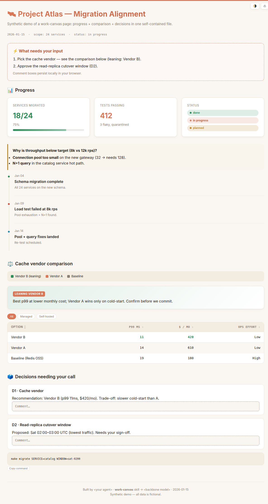
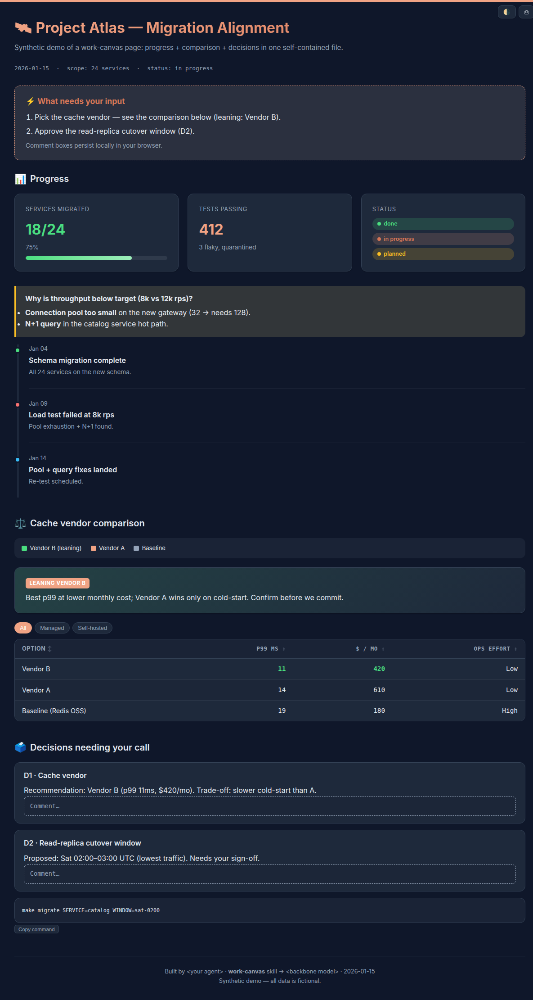

# 🛰️ work-canvas

> Turn an agent's work — progress, debugging, analysis, comparisons, decisions — into a single, self-contained, reviewable HTML page you open in a browser.

**English** | [中文](README.zh-CN.md)

[](LICENSE)

When a long or messy task is better *seen* than read line-by-line in a terminal, `work-canvas` has the agent render its own work as one offline-openable HTML "work canvas".

| Light | Dark |
|---|---|
|  |  |

## Why

Inspired by the idea (popularized by Andrej Karpathy) that an agent's output is often better rendered as a visual page than read as a wall of text. Terminal logs are the wrong medium for long, multi-subsystem, trial-and-error work — you want the whole picture, what broke, and what needs your input, in one glance.

## What it produces

Three artifact types, each with a ready-made section skeleton and components:

- **Progress / status report** — KPI cards, a debugging timeline, status badges, action items with the next command attached.
- **Review / decision memo** — a verdict plus numbered decisions with inline, persistent comment boxes you can mark up; tabs or a sidebar for long content.
- **Comparison / leaderboard** — sortable / filterable tables with cost & latency columns, side-by-side panels, and an image lightbox.

Every page is **one self-contained file** (inline CSS/JS, embedded media, no CDN) that opens by double-click, offline. Light theme by default, dark via a toggle.

## Install

This skill is **agent-installable**. The repo ships a packaged **`work-canvas.skill`** — a zip of just the skill folder (`SKILL.md` + `assets/` + `references/`, no repo extras), so it's the cleanest thing to install.

Paste the following to your coding agent (Claude Code, Codex, Pi, OpenCode, …):

```text
Download https://raw.githubusercontent.com/JingbiaoMei/work-canvas-skill/main/work-canvas.skill
(it's a zip). Extract it, and install the resulting `work-canvas/` folder for all my local
coding agents — copy it into each tool's skills directory (e.g. ~/.claude/skills/,
~/.codex/, ~/.agents/), as each tool expects. Then tell me where you installed it.
```

The `.skill` unzips to a clean `work-canvas/` folder, ready to drop into any agent's skills directory.

## Use

Once installed, just ask — the skill triggers on intent:

- "Make a **work-canvas progress report** for this benchmark run."
- "Give me a **reviewable HTML** to align on the design and decide next steps."
- "Build a **comparison canvas** of these three options."
- Use `/goal` for a long task; when the goal ends, the agent generates a
  **work-canvas progress/status report** for that goal.

Or open [`examples/demo.html`](examples/demo.html) to see a rendered example.

## What's in the box

```
SKILL.md                 router + workflow + conventions
assets/
  base.css               dual-theme design system (inlined into the page)
  interactions.js        opt-in vanilla-JS modules: theme · tabs · sort/filter · lightbox · copy · scrollspy · persist
  starter.html           copy-and-fill skeleton
references/
  progress-report.md     section skeleton + component recipes, one per type
  review-decision.md
  comparison.md
examples/
  demo.html / demo.zh-CN.html   synthetic showcase (EN / 中文), no real data
work-canvas.skill        packaged skill bundle
```

## Principles (enforced for every page)

- **Self-contained** single file, offline-openable.
- **Provenance footer** — which agent + model + date built it.
- **Surface only real open questions** — never pad with already-resolved decisions.
- **Never confuse the reader** — a legend wherever a color or letter encodes meaning.
- **Non-destructive** — never edits your source files; shows paste-ready output instead.

## License

[Apache-2.0](LICENSE) © 2026 Jingbiao Mei
