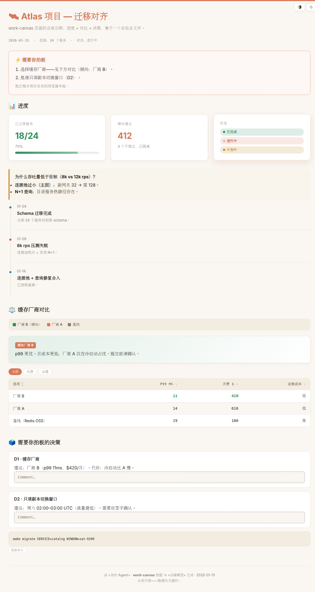
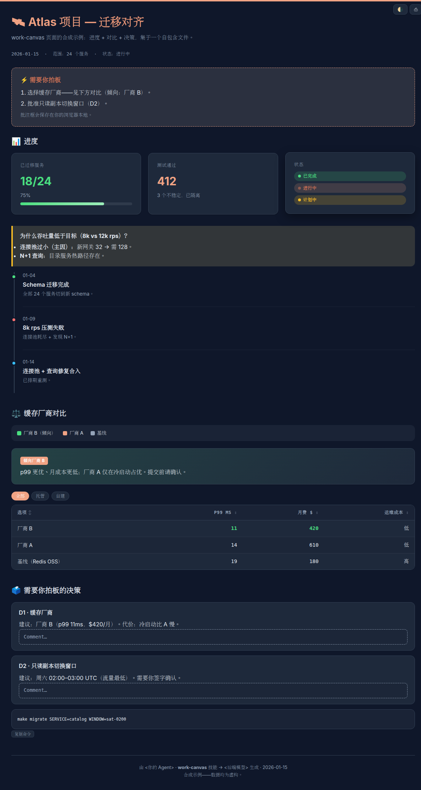

# 🛰️ work-canvas

> 把 Agent 的工作——进度、调试、分析、对比、决策——渲染成一个自包含、可审阅的网页，在浏览器里打开即可。

[English](README.md) | **中文**

[](LICENSE)

当一个又长又乱的任务“看”比在终端里逐行“读”更合适时，`work-canvas` 让 Agent 把自己的工作渲染成一个可离线打开的 HTML 网页看板。

| 浅色 | 深色 |
|---|---|
|  |  |

## 为什么

灵感来自 Andrej Karpathy 推广的一个想法：Agent 的输出与其让人读一大段文字，不如渲染成可视化的网页。对于长时间、跨多个子系统、反复试错的工作，终端日志是错误的媒介——你想要的是一眼看清全局、哪里出了问题、以及哪些需要你拍板。

## 它能产出什么

三种产物类型，每种都自带现成的结构骨架与组件：

- **进度 / 状态报告**——KPI 卡片、调试时间线、状态徽章、带“下一条命令”的待办项。
- **审阅 / 决策备忘**——结论，加上编号决策（内嵌可编辑、可持久化的批注框）；长内容可用标签页或侧边栏。
- **对比 / 排行榜**——可排序、可筛选的表格（含成本、延迟列）、并排面板、图片灯箱。

每个页面都是**一个自包含文件**（内联 CSS/JS、嵌入媒体、无 CDN），双击即可离线打开。默认浅色主题，可一键切换深色。

## 安装

本技能**可由 Agent 自行安装**。仓库随附打包好的 **`work-canvas.skill`**——它只是技能文件夹（`SKILL.md` + `assets/` + `references/`，不含仓库里的其他文件）的压缩包，因此是最干净的安装来源。

把下面这段话粘贴给你的编码 Agent（Claude Code、Codex、Pi、OpenCode 等）：

```text
下载 https://raw.githubusercontent.com/JingbiaoMei/work-canvas-skill/main/work-canvas.skill
（这是一个 zip）。解压它，并为我所有本地编码 Agent 安装解压出的 `work-canvas/` 文件夹——
把它复制到每个工具各自的技能目录（例如 ~/.claude/skills/、~/.codex/、~/.agents/），
按各工具的约定放置。完成后告诉我装到了哪里。
```

`.skill` 解压后是一个干净的 `work-canvas/` 文件夹，可直接放进任何 Agent 的技能目录。

## 使用

安装后直接说需求即可——技能按意图触发：

- “给这次评测跑批做一个 **work-canvas 进度报告**。”
- “给我一个**可审阅的 HTML**，对齐设计并决定下一步。”
- “给这三个方案做一个**对比看板**。”
- 使用 `/goal` 执行长任务；目标结束时，Agent 为该目标生成 **work-canvas 进度/状态报告**。

也可以直接打开 [`examples/demo.zh-CN.html`](examples/demo.zh-CN.html) 看示例。

## 目录结构

```
SKILL.md                 路由 + 工作流 + 约定
assets/
  base.css               双主题设计系统（内联进页面）
  interactions.js        可选的原生 JS 模块：主题 · 标签页 · 排序/筛选 · 灯箱 · 复制 · 滚动跟随 · 持久化
  starter.html           复制即用的骨架
references/
  progress-report.md     各类型的结构骨架 + 组件配方
  review-decision.md
  comparison.md
examples/
  demo.html / demo.zh-CN.html   合成示例（英文 / 中文），无真实数据
work-canvas.skill        打包好的技能
```

## 原则（每个页面强制遵守）

- **自包含**单文件，可离线打开。
- **出处页脚**——由哪个 Agent + 哪个模型 + 日期生成。
- **只暴露真正需要你拍板的问题**——绝不拿已决事项凑数。
- **绝不让读者困惑**——凡是用颜色/字母编码含义处，必有图例。
- **非破坏性**——绝不改你的源文件；给出可直接粘贴的产物。

## 许可证

[Apache-2.0](LICENSE) © 2026 Jingbiao Mei
